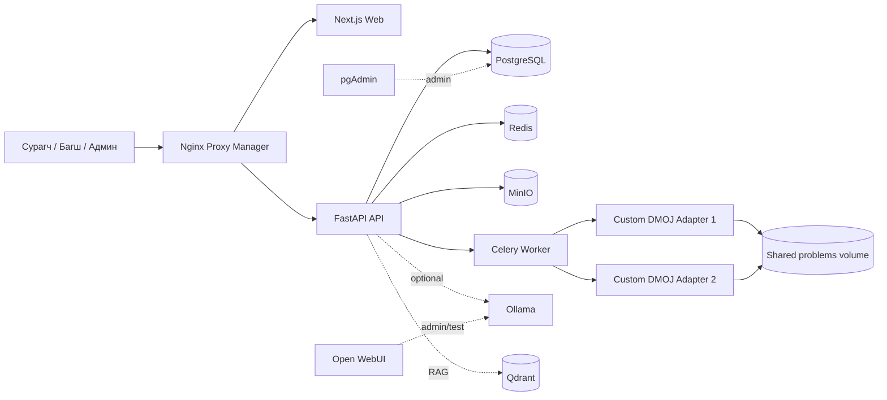
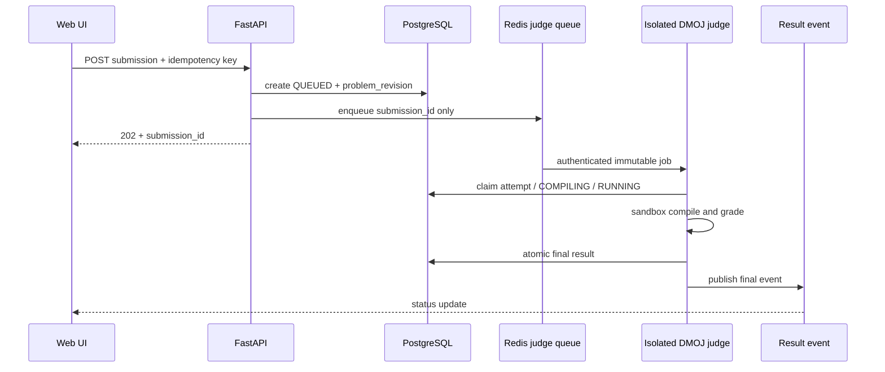

# Онлайн Judge платформын иж бүрэн аудит ба хөгжүүлэлтийн замын зураг

> Аудит хийсэн огноо: 2026-08-25  
> Хамрах хүрээ: одоогийн `main` (`4019b51`) болон working tree-д байгаа Flowgorithm/Scratch өөрчлөлт  
> Зорилтот орчин: нэг сургууль, 100–500 сурагч, 20–50 зэрэг илгээлт, NVIDIA GPU бүхий нэг Linux сервер

## Хэрэгжилтийн явц

> Сүүлд шинэчилсэн: 2026-08-27
> Төлөв: `Хийгдээгүй` → `Хэсэгчлэн` → `Баталгаажуулж байна` → `Бүрэн дууссан`

| Багц | Төлөв | Хийгдсэн үр дүн | Дуусгахын тулд дараагийн алхам |
|---|---|---|---|
| P0.1 Sandbox-only execution | **Бүрэн дууссан** | Submission endpoint → Redis/Celery → DMOJ → PostgreSQL/PubSub E2E; duplicate delivery, dead bridge retry, Celery container SIGKILL → Redis redelivery → expired DB lease reclaim бүгд AC бөгөөд JudgeResult/XP давхардаагүй; workspace API dispatch → MinIO → Celery → DMOJ → MinIO E2E AC; actual ASGI cookie/CSRF/RBAC/WebSocket snapshot AC | P1 load/chaos regression-д тасралтгүй хадгалах |
| P0.2 Verdict ба archive integrity | **Бүрэн дууссан** | Төвлөрсөн bounded ZIP validator/extractor; traversal, symlink, duplicate, size/count/depth/compression ratio хамгаалалт; actual ASGI multipart дээр дөрвөн ZIP boundary 400/no-side-effect; bounded Flowgorithm XML/Scratch JSON fail-fast; `AC/WA/CE/RTE/TLE/MLE/OLE/SYSTEM_ERROR`; native custom checker, subtask/batch scoring, interactive, signature болон bundled sample matrix амжилттай | P1 regression corpus-д тасралтгүй хадгалах |
| P0.3 Secret/network/dependency | **Хэсэгчлэн** | Production secret/HTTPS CORS/cookie startup validation; Compose mounted secret-file override ба fail-fast backend loader; PostgreSQL/MinIO file-only credential startup smoke; internal data-service ports хаалттай; admin port localhost; profiles/internal judge network; capability/PID/RAM limit; үндсэн image digest pin; API/Celery/migration default UID 1000 non-root; bridge runtime smoke | Бодит credential rotation drill; NPM/pgAdmin/Open WebUI credential policy; үлдсэн service image digest lock; read-only root/AppArmor/seccomp policy батлах |
| P0.4 CI/test baseline | **Хэсэгчлэн** | GitHub Actions backend/frontend/Compose gate; reproducible non-root backend image; 87/87 backend test pass; live/ready/WebSocket snapshot tests; `tsc --noEmit`; migration/Compose validation; DMOJ verdict/advanced-grader/generator/submission/workspace/hard-kill, actual ASGI auth/WebSocket/upload security smoke | Frontend 123 error/216 warning lint өр; webpack/Turbopack build; үлдсэн warning арилгах |
| P1 Найдвартай ажиллагаа | **Хийгдээгүй** | — | P0 exit criteria бүрэн хангах |
| P2 Visual IR/Flowgorithm | **Хийгдээгүй** | — | P1 дууссаны дараа IR schema батлах |
| P3 Scratch/AI/remote judge | **Хийгдээгүй** | — | P2 pilot үр дүнгээр эхлүүлэх |

### P0 ажлын тэмдэглэгээ

`[x]` нь код болон тохирох автомат/runtime шалгалтаар бүрэн батлагдсан дэд ажил; багцын үлдсэн шалгуурыг бүхэлд нь дууссан гэж ойлгохгүй.

- P0.1 Sandbox-only execution
  - [x] Submission болон sample run-ийг async Celery/DMOJ queue contract-д шилжүүлсэн
  - [x] Empty testcase mock AC болон production local subprocess fallback-ийг устгасан
  - [x] Workspace model-solution-ийг persistent async judge job болгосон
  - [x] Pinned DMOJ image dynamic problem grading, health, үндсэн verdict smoke давсан
  - [x] Workspace testlib generator-ийг output-producing persistent DMOJ sandbox job болгосон
  - [x] Submission endpoint → Redis/Celery → DMOJ → DB/PubSub E2E, duplicate delivery ба dead-bridge retry
  - [x] Celery container SIGKILL, Redis redelivery, expired `RUNNING` DB lease reclaim, atomic final+XP
  - [x] Workspace API dispatch → MinIO → Celery → DMOJ → MinIO full-stack E2E
  - [x] Actual ASGI cookie/CSRF/RBAC/refresh rotation/WebSocket handshake
- P0.2 Verdict/archive integrity
  - [x] `OLE`, `SYSTEM_ERROR`, DMOJ `IR → RTE` mapping болон fail-closed error урсгал
  - [x] Empty/invalid testcase AC өгөхгүй болсон
  - [x] Central bounded ZIP validator/extractor болон unit negative corpus
  - [x] Fresh DB bootstrap, previous head → current head migration smoke
  - [x] Upload/import API бүрийн archive/XML/JSON adversarial integration test
  - [x] Custom checker, subtask, interactive, signature grader regression corpus
- P0.3 Secret/network/dependency
  - [x] Production insecure default/HTTP CORS/insecure cookie startup validation
  - [x] Data-service public port closure, localhost admin binding, Compose profiles
  - [x] Egress-гүй judge network, runtime capability/PID/RAM smoke
  - [x] API, Celery, migration UID/GID 1000 non-root runtime smoke
  - [x] Python/Node/PostgreSQL/Redis/DMOJ үндсэн image digest pin
  - [x] Compose secret file ingestion ба PostgreSQL/MinIO/backend runtime smoke
  - [ ] Production credential rotation drill ба admin-tool credential policy
  - [ ] Үлдсэн image digest, read-only root, AppArmor/seccomp policy
- P0.4 CI/test baseline
  - [x] Backend/frontend/Compose GitHub Actions baseline
  - [x] Backend 87/87 test, fresh/downgrade/upgrade migration, live/ready/WebSocket snapshot tests
  - [x] Python compile, TypeScript typecheck, Compose profile, diff validation
  - [x] DMOJ socket verdict smoke matrix
  - [ ] Frontend ESLint zero-error ба production build
  - [ ] Backend 5 warning, component/E2E/security scan gate

### Одоогийн өөрчлөлтийн тайлбар

- `POST /submissions` дандаа Celery `judge_queue` руу орно. `is_sample_test=true` үед зөвхөн public sample testcase-г DMOJ-д өгнө.
- Хуучин synchronous `/problems/{code}/run-samples` нь `410 Gone`; frontend шинэ queue contract ашиглана.
- Workspace model solution болон generator endpoint API контейнерт binary ажиллуулахгүй; `202 + job_id` persistent Celery/DMOJ урсгал ашиглана.
- Worker judge идэвхгүй/холболтгүй үед mock AC/RTE зохиохгүй. Түр алдаанд retry хийж, эцсийн оролдлого дуусвал `SYSTEM_ERROR` хадгална.
- ZIP validator нь archive upload/read/extract өмнө canonical path, symlink, duplicate, corruption, expanded size ба compression ratio шалгана.
- Production config insecure default secret, `COOKIE_SECURE=false`, localhost CORS-той бол startup fail хийнэ. Бодит production secret file-үүдийг үүсгэхгүйгээр шинэ API асахгүй.
- MinIO bucket initialization module import үеэс FastAPI startup lifecycle руу шилжсэн. Иймээс unit test/CLI import external network-оос хамаарахгүй, production startup MinIO-г заавал шалгана.
- Repository-ийн хуучин Alembic chain хоосон schema үүсгэж чаддаггүйг smoke test илрүүлсэн. `migrate` job нь хоосон DB-д current metadata schema үүсгэн head stamp хийх, version-тэй DB-д `upgrade head` хийх, харин non-empty unversioned DB-г fail-closed болгох болсон.
- Fresh DB runtime smoke нь world startup seed `student_levels.id=1` гэж хатуу таамагласнаас FK алдаатай байсныг илрүүлсэн. Startup одоо Bronze түвшинг нэрээр idempotent үүсгэж/олж, бодит ID-г world FK-д ашиглана.
- Judge bridge нь public/outbound сүлжээнээс салсан `judge-network` дээр ажиллана. API/worker process-уудад `no-new-privileges`, capability drop, PID/RAM limit нэмсэн.
- Workspace model solution шалгалт `workspace_judge_jobs` хүснэгтэд хадгалагдаж, `QUEUED → RUNNING → FINAL/SYSTEM_ERROR` төлөвтэй Celery/DMOJ job болсон. API process зөвхөн job үүсгэнэ; bounded source/testcase-г worker MinIO-оос уншиж, frontend poll хийнэ. Owner/admin access шалгалттай.
- Workspace testlib generator мөн `202 + job_id` persistent урсгалтай. Нэг job 1–20 bounded parameter мөр хүлээн авч, мөр бүрийн synthetic `argc/argv`-г actual generator `main` lifecycle дотор `registerGen`-д өгнө. Generator stdout болон model-solution stdout-ийг DMOJ-ийн output limit-тэй capture mode-оор авч, бүх case амжилттай болсны дараа л draft `.in/.out/init.yml` хадгална. Full smoke дээр `1 10`, `50 60` input-оос `11`, `110` output зөв үүссэн.
- Pinned DMOJ tier-3 bridge image socket smoke дээр `HEALTHY`, `AC`, `WA`, `CE`, signal/non-zero-exit `RTE`, `TLE`, Java OOM `MLE`, `OLE` бүгд зөв гарсан. Python 3.14-ийн default `forkserver` нь dynamic problem cache-г child process-д дамжуулахгүй байсныг single-threaded bridge дээр explicit `fork` болгож зассан.
- DMOJ non-zero exit-ийг `IR` flag-аар илэрхийлдэг боловч bridge map-д байхгүйгээс WA болж хувирч байсан verdict integrity алдааг `IR → RTE` болгож зассан. MLE fixture-ийг allocation error-ийг буруу MLE болгохгүйгээр DMOJ-ийн Java executor-ийн албан OOM mapping-аар баталгаажуулсан.
- `/health/live` нь dependency-гүй liveness, `/health/ready` нь PostgreSQL, Redis, MinIO бүгд бэлэн үед л 200, бусад үед 503 буцаана. Compose API healthcheck readiness ашиглана.
- Bridge allocation нь stale idle-host list бус Redis per-host lease ашиглана. Connection failure lease-ийг суллаж, Celery fail-closed retry дараагийн bridge рүү round-robin хийнэ. Celery `late ack`, worker-lost redelivery, prefetch=1 тохиргоотой; stale `RUNNING` DB lease-ийг redelivery үед reclaim хийнэ.
- Ephemeral full pipeline smoke дээр pending/final duplicate delivery ignore, хоёр testcase-ийн нэг удаагийн JudgeResult, нэг удаагийн XP, Redis final event, dead bridge → 3 секунд retry → healthy bridge AC бүгд батлагдсан.
- Submission болон workspace job `judge_attempt` + expiring DB lease-тэй болсон. Redis visibility timeout env-configurable (default 600 секунд). Hard-kill smoke дээр attempt 1 RUNNING worker-ийг SIGKILL хийж, unacked task шинэ worker-д redeliver болоход expired lease reclaim хийн attempt 2 AC, хоёр JudgeResult, XP=20 болсон.
- Final verdict/JudgeResult болон үндсэн XP/reward marker нэг transaction boundary-д commit хийгдэнэ. Иймээс worker final commit-ийн өмнө үхвэл бүх өөрчлөлт rollback/reclaim; commit-ийн дараа үхвэл terminal status дахин reward олгохгүй.
- Level/achievement зэрэг post-reward hook алдаа нь commit болсон terminal submission-ийг `PENDING` болгохгүй; hook бүр rollback/log хийгээд дараагийн optional hook-ийг үргэлжлүүлнэ.
- Fresh isolated Compose stack дээр workspace verify job `AC`, generator-ийн хоёр мөр болон model-solution `AC`; MinIO-д `1 10 → 11`, `50 60 → 110`, шинэ `init.yml` round-trip батлагдсан. Smoke script түр object/DB мөрөө цэвэрлэнэ.
- WebSocket Redis subscribe хийсний дараа DB snapshot явуулдаг болсон. Ингэснээр client холбогдохоос өмнө final event publish болсон ч terminal төлөв алдагдахгүй.
- Public registration нь `teacher/admin` role авахыг 403 болгож privilege escalation-ийг хаасан; student progress бодит Bronze level ID ашиглана. Actual ASGI smoke cookie auth, CSRF, refresh rotation/replay reject, student/teacher RBAC болон terminal WebSocket snapshot-ийг баталсан.
- Fresh SMTP config өмнө нь credential байхгүй ч enabled гэж тооцогдон, mail илгээгээгүй мөртлөө хэрэглэгчийг unverified түгждэг байсан. SMTP одоо explicit opt-in; production enabled үед host/user/password/from-address бүрэн биш бол startup validation fail хийнэ.
- Upload body-г parser руу өгөхөөс өмнө 64MB+1 bounded read хийж 413 буцаана. ZIP ашигладаг testcase, problem package, problem import, workspace route бүр traversal/symlink/duplicate/compression-bomb corpus-той; actual ASGI multipart traversal smoke бүгд 400 бөгөөд DB side effect үүсгээгүй.
- Problem import `problem.json` object/type/code/string/count/depth/node limit-ээ DB write-ээс өмнө шалгаж, validation алдаанд rollback+400 хийнэ. Эхний premature commit устсан.
- Flowgorithm source 512KB/node/depth/attribute limit-тэй, DTD/entity хоригтой. Scratch prototype raw Python fallback-гүй болж, bounded JSON object болон non-empty bounded `python_code` шаарддаг; visual submission malformed бол DB/job үүсэхээс өмнө 400.
- Native DMOJ advanced-grader smoke нь custom checker `AC/WA`, interactive `AC/WA`, function-signature `AC/WA`-г баталсан. Batch packet metadata-г bridge хадгалдаг болж, subtask оноог child case бүрээр давхар нэмэх бус бүх child AC үед outer batch points-оор тооцно; regression үр дүн full `100`, нэг 60-point batch унахад `40` болсон. DMOJ-ийн short-circuit `SC` төлөвийг AC мэт харагдуулахгүйгээр fail-closed `WA` болгов.
- Repository-ийн custom checker, interactive, function-signature sample ZIP-үүдийг DMOJ v5 native `init.yml` schema болон private helper asset-тай болгосон. Interactive helper-ийн memory limit нь DMOJ-ийн KB нэгжээр `65536`; bundled гурван package бодит compile/run дээр бүгд `AC` болсон.
- `docker-compose.secrets.yml` production override нь API/migrate/Celery-ийн `.env` inheritance-ийг reset хийж, JWT, database URL, MinIO болон DMOJ key-г `/run/secrets/*` read-only file-аар өгнө. PostgreSQL/MinIO direct password environment-ийг Compose merge-ээс устгаж, албан `_FILE` contract ашиглана; `.env` болон `secrets/` version control-оос хасагдсан.
- Backend startup нь `SECRET_KEY`, `DATABASE_URL`, `REDIS_URL`, MinIO credential, DMOJ key, SMTP password-ийн `*_FILE` хувилбарыг bounded UTF-8 text байдлаар уншина. File байхгүй/хоосон эсвэл process environment-д direct утга давхар өгөгдвөл fail-fast. Rendered production Compose-д direct secret value байхгүй, PostgreSQL болон MinIO file-only startup smoke pass болсон; бодит өгөгдөлтэй credential rotation drill дараагийн ажил хэвээр.
- API/Celery/migration image default `uid=1000(oj), gid=1000`; DMOJ `judge` UID/GID-тэй таарсан `/problems` permission-тай. Non-root pipeline runtime smoke pass.
- Docker backend test image дотор 87 test амжилттай; Pydantic v2, AsyncMock fixture, Qdrant compatibility warning үлдсэн. Frontend TypeScript шалгалт амжилттай, lint 123 error/216 warning; local Turbopack build нь орчны process/port restriction дээр panic болсон тул application build-ийн pass/fail хараахан батлагдаагүй.

### Яг дараагийн алхам

1. PostgreSQL/MinIO/API нууцыг backup-тай staging өгөгдөл дээр дарааллаар rotate хийж, хуучин credential хүчингүй болсон болон rollback/recovery-г батлах; NPM/pgAdmin/Open WebUI credential fallback-ийг бүрэн хориглох.
2. Үлдсэн service image-ийг digest-аар pin хийж, read-only root filesystem болон AppArmor/seccomp policy-г runtime smoke-оор батлах.
3. Frontend lint error-ийг багцаар цэвэрлээд webpack/Turbopack production build, component/E2E gate ажиллуулах.
4. Generator-ийн per-parameter compile болон 50 concurrent submission load budget хэмжих; queue wait/lease/visibility timeout-ийг хэмжилтээр тохируулах.

## 1. Удирдлагын хураангуй

Платформын бүтээгдэхүүний суурь зөв сонгогдсон. Next.js/FastAPI хослол, PostgreSQL, Redis/Celery, MinIO, DMOJ tier-3, хичээл–бодлого–анги–тэмцээн–ахицын өгөгдлийн загвар нь нэг сургуулийн хэмжээний интерактив сургалтын системийг хөгжүүлэхэд хангалттай. Багшийн problem workspace, custom checker, subtask, MinIO package, WebSocket үр дүн, RBAC, CSRF, refresh token, gamification, AI-ийн feature flag зэрэг бодитой ажил эхэлсэн байна.

Аудит эхлэх үед системийг интернетэд production хэлбэрээр нээх боломжгүй байсан гол шалтгаан нь sample run болон judge унтарсан горимд сурагчийн код API/Celery контейнерийн дотор энгийн `subprocess`-оор ажилладаг явдал байв. Энэ замыг одоогийн working tree-д хааж, submission/sample/model-solution/generator-ийг DMOJ queue boundary руу шилжүүлсэн. Submission queue, dead-bridge retry, hard-kill reclaim, workspace full-stack E2E, archive endpoint integration болон advanced grader correctness батлагдсан ч secret rotation/Compose secrets, үлдсэн container hardening, frontend quality gate бүрэн дуусаагүй тул **P0 production hold одоогоор хэвээр**.

Одоо үлдсэн том эрсдэлүүд нь production credential rotation, бүх image-ийн immutable pin, үлдсэн container policy, backup/restore, observability болон frontend quality debt юм. Host exposure, mock AC, infrastructure→RTE, worker hard-kill recovery, workspace full-stack pipeline, advanced grader, actual auth/WebSocket болон malicious upload boundary зэрэг анхны P0 олдворын хэд хэдэн хэсэг working tree-д засагдсан. Frontend lint baseline 123 error/216 warning; backend reproducible image suite 87 pass болсон.

### Шийдвэр

1. **P0 дуусахаас өмнө production launch хийхгүй.**
2. Бүх төрлийн хэрэглэгчийн кодыг, тэр дундаа sample run, visual program, teacher solution test-ийг нэг л тусгаарлагдсан judge pipeline-аар ажиллуулна.
3. Нэг серверийн Docker Compose-ийг хадгална; Kubernetes одоохондоо шаардлагагүй.
4. AI-г optional `ai` profile болгоно. AI тасарсан ч үндсэн сургалт, бодлого, тэмцээн, judge бүрэн ажиллах ёстой.
5. Flowgorithm болон Scratch-ийг шууд Python текст болгон хадгалах бус, платформын versioned `VisualProgramDocument` завсрын загвараар холбоно.

## 2. Аудитын арга ба хязгаарлалт

Шинжилгээнд дараахыг ашиглав:

- `docker-compose.yml`, бүх Dockerfile, backend config/security/session, API endpoint, worker, DMOJ adapter, model/migration;
- frontend route, API client, visual IDE-ийн одоогийн uncommitted код;
- `docker compose config --services` болон `--images` статик шалгалт;
- Python `compileall`, frontend ESLint;
- DMOJ, Docker, OWASP, Flowgorithm-ийн албан эх сурвалж.

Хязгаарлалт:

- Анхны аудитад Docker runtime шалгагдаагүй байсан; хэрэгжилтийн шатанд pinned DMOJ image build, `no-new-privileges + SYS_PTRACE`, egress-гүй internal network, dynamic problem grading болон verdict matrix-ийг isolated ephemeral контейнерээр баталсан. App-ийн бүх сервисийг production compose байдлаар зэрэг асаасан load/E2E test хараахан хийгдээгүй.
- Анхны аудитад host `pytest` байгаагүй; одоо reproducible backend image дотор 87 test pass болсон. PostgreSQL fresh bootstrap, downgrade болон өмнөх Alembic head-ээс upgrade smoke pass болсон.
- Production traffic, хэрэглэгчийн analytics, серверийн бодит CPU/RAM/GPU хэмжилт өгөөгүй тул capacity тоонууд нь эхний load-test target юм.
- Working tree-ийн хэрэглэгчийн өөрчлөлтийг аудитад хамруулсан боловч засварлаагүй.

## 3. Одоогийн архитектур



### 3.1 Сервисийн үнэлгээ

| Сервис | Одоогийн үүрэг | Төлөв | Зөвлөмж |
|---|---|---:|---|
| Next.js 16 / React 19 | Сурагч, багш, админы UI | Partial | Хадгална; lint/type/E2E gate болон standalone production image нэмнэ |
| FastAPI | REST API, auth, content, submission dispatch | Partial | Хадгална; request validation, readiness, metrics, audit log, judge execution-ээс бүрэн салгана |
| PostgreSQL 16 | Transactional үндсэн өгөгдөл | Partial | Хадгална; backup/PITR, connection budget, migration job, private network |
| Redis 7 | Celery broker, Pub/Sub, rate limit | Partial | Хадгална; auth/TLS шаардлагыг network boundary-тай уялдуулж, queue ба cache namespace/DB салгана |
| Celery | Judge/AI background ажил | Partial | Queue-г `judge`, `ai`, `maintenance` болгон салгаж, idempotency ба visibility timeout тогтооно |
| MinIO | Problem package, asset, submission storage | Partial | Хадгална; least-privilege service account, versioning/lifecycle, backup, checksum |
| Custom DMOJ adapter | DMOJ local API-г socket-оор дуудах | Prototype | Security/correctness contract-ыг тогтворжуулж version pin; official DMOJ lifecycle-тэй regression test хийнэ |
| Nginx Proxy Manager | TLS/reverse proxy | Partial | Хадгалж болно; зөвхөн 80/443 public, port 81 VPN/IP allowlist |
| Ollama | Local tutor/curator model | Prototype/optional | `ai` profile; GPU memory budget, timeout, moderation/evaluation |
| Qdrant | RAG vector store | Prototype/optional | AI идэвхтэй үед л асаах; auth, snapshot/restore, source provenance |
| Open WebUI | AI туршилт/админ | Development tool | `admin-tools` profile; public exposure хориглоно |
| pgAdmin | DB админ UI | Development tool | `admin-tools` profile; public exposure хориглоно |

### 3.2 Бүтээгдэхүүний боломжийн төлөв

| Чиглэл | Кодод байгаа зүйл | Үнэлгээ | Production-д дутуу зүйл |
|---|---|---:|---|
| Auth/RBAC | Access/refresh cookie, CSRF, role dependency, email verify/reset | Partial | Secret rotation, proxy-aware rate limit, session/audit tests, admin security |
| Бодлого | CRUD, hint, testcase, package import/export, asset, workspace | Partial | Immutable revision, package schema/checksum, safe extraction, rollback |
| Judge | Queue, 2 adapter, олон хэл, checker/subtask draft | Prototype/Partial | Sandbox-only path, error taxonomy, idempotency, OLE, interactive/signature E2E |
| Хичээл | Markdown, quiz, gated content, lesson/problem relation | Partial | Curriculum prerequisite, mastery rubric, accessibility, content review/version |
| Анги | Enrollment, lesson assignment, progress matrix, CSV | Partial | Tenant/ownership test, privacy boundary, teacher workflow validation |
| Тэмцээн | Registration, individual/team standings, live board | Partial | Freeze, penalty/rejudge consistency, concurrency tests, anti-cheat |
| Gamification | XP, achievements, worlds/stages, duel | Prototype/Partial | Transactional idempotency, abuse controls, learning-aligned reward evaluation |
| AI | Ollama tutor, curator, Qdrant | Prototype | Evaluation set, prompt-injection/data-leak defense, source citation, cost/capacity |
| Flowgorithm | Block UI, Python/C++ generation, draft XML parser/export | Prototype | Албан `.fprg` compatibility, IR, validation, round-trip, safe judge path |
| Scratch | UI mode ба JSON-аас `python_code` авах stub | Prototype | Жинхэнэ `.sb3` ZIP/project.json/assets/parser, semantic adapter, round-trip policy |
| Offline/PWA | Offline page байна | Prototype | Manifest/service worker/cache policy, stale content indication, submission queue policy |

## 4. Эрсдэлийн нэгдсэн матриц

Эрэмбэ: **Critical** — production-ийг хориглоно; **High** — launch-аас өмнө эсвэл эхний 30–90 хоногт; **Medium** — тогтвортой өсөлтөд; **Low** — чанар/өртгийн сайжруулалт.

| ID | Түвшин | Олдвор ба нотолгоо | Болзошгүй нөлөө | Шийдэл | Ээлж |
|---|---|---|---|---|---|
| J-01 | **Critical** | `submissions.py` sample/judge-off үед `LocalSubprocessJudge`-г API thread pool-д ажиллуулна; worker мөн sample үед local judge ашиглана. `local_judge.py` нь `subprocess.Popen`-ийг OS sandbox-гүй дууддаг | RCE, secret/DB/MinIO хулгай, дотоод сүлжээний халдлага, host/container compromise | Local execution-ийг production code path-аас устгаж, sample/run/test-solution/visual бүгдийг тусгаарлагдсан DMOJ queue руу шилжүүлэх | P0 |
| J-02 | **Critical** | Testcase болон package байхгүй үед worker шууд AC, бүтэн оноо олгодог | Хуурамч зөв хариу, XP/standings эвдрэх | `INVALID_PROBLEM`/`JUDGE_ERROR` terminal state; publish-ийг хориглох validator | P0 |
| S-01 | **Critical** | JWT, DB, MinIO, judge, Open WebUI, pgAdmin default secret код/Compose-д байна | Default credential-ээр бүрэн нэвтрэх | Production startup-д required secret validation, Compose secret/file, rotation runbook | P0 |
| S-02 | **High** | PostgreSQL 5432, MinIO 9000/9001, Ollama 11434, Open WebUI 3080, Qdrant 6333/6334, pgAdmin 5050, NPM admin 81 host-д bind хийсэн | Internet/LAN lateral access, data/AI/admin compromise | Зөвхөн 80/443 public; admin VPN/SSH tunnel; internal network `internal: true` | P0 |
| J-03 | **High** | Adapter internal DMOJ Python class/packet API ашиглаж, зарим packet no-op; бүх exception-ийг RTE болгон буцаана | DMOJ update эвдэх, system failure сурагчийн RTE болох, retry буруу | Versioned adapter contract; `SYSTEM_ERROR`; compatibility/E2E tests; DMOJ commit pin | P0 |
| J-04 | **High** | Adapter TCP 9999-д auth/TLS/message signature-гүй сонсоно | Internal network-д хандсан сервис дурын code job үүсгэнэ | Isolated judge network, authenticated job envelope/HMAC эсвэл mTLS, allowlist, replay protection | P0/P1 |
| S-03 | **High** | ZIP файлууд `extractall`-аар canonical path, symlink, size/count шалгалтгүй задарна | Zip-slip, arbitrary overwrite, zip bomb, disk exhaustion | Central safe archive extractor: normalized path, symlink deny, total/file size/count/depth limits | P0 |
| B-01 | **High** | `latest`, `main`, `master`, мөн Python dependencies `>=` хэрэглэсэн | Давтагдахгүй build, supply-chain drift, гэнэтийн incompatibility | Version + digest/lock pin; Renovate/Dependabot PR; SBOM ба image scan | P0/P1 |
| O-01 | **High** | DB/Redis-ээс бусад meaningful healthcheck/readiness алга; API health dependency шалгахгүй | Partial outage healthy мэт харагдах, restart storm, job loss | `/live`, `/ready`, dependency health; Compose healthcheck; graceful shutdown | P1 |
| O-02 | **High** | Backup/restore automation, off-host copy, restore drill кодод алга | Server/disk/operator алдаагаар сургалтын бүх өгөгдөл алдах | Encrypted daily backup, MinIO versioning, off-host copy, улирал тутмын restore drill | P1 |
| Q-01 | **High** | Frontend lint 124 error/216 warning; backend tests host дээр ажиллах орчин бүрдээгүй; CI workflow алга | Regression илрэхгүй, release quality хэмжигдэхгүй | Reproducible dev/test container; lint/type/test/E2E/security CI gate | P0/P1 |
| O-03 | **Medium** | Resource/PID/output/disk limit бараг байхгүй; bridge зөвхөн core 0/1-д pin хийсэн | 50 submission үед starvation/DoS, GPU/AI нь judge-г шахах | Benchmark-based CPU/RAM/PID limits, output quota, queue backpressure; AI GPU profile | P1 |
| A-01 | **Medium** | Login rate limit `request.client.host` ашигладаг | Reverse proxy ард бүх хэрэглэгч нэг IP болох эсвэл spoofing хийх | Trusted proxy chain-ийг нэг газарт validate; user/IP/device limit; Redis atomic script | P1 |
| D-01 | **Medium** | Published problem immutable revision/checksum-гүй; submission одоогийн problem-той холбоотой | Бодлого засахад хуучин дүн дахин давтагдахгүй | `problem_revision`, immutable manifest, submission revision FK, controlled rejudge | P1 |
| V-01 | **Medium** | Draft `.fprg` root нь `<program>`; Scratch transpiler жинхэнэ `.sb3` биш | Файл нийцэхгүй, сурагчийн ажил алдагдах, misleading UX | Versioned IR + validated import/export adapters + corpus round-trip tests | P2/P3 |
| P-01 | **Medium** | Хүүхдийн мэдээлэл, source code, AI prompt-ийн retention/consent/export/delete бодлого харагдахгүй | Privacy, эцэг эх/сургуулийн итгэл, хууль/дотоод бодлогын эрсдэл | Data inventory, minimum collection, retention, consent, audit/export/delete workflow | P1 |
| O-04 | **Medium** | Metrics, tracing, centralized structured logs, alerts алга | Contest үеийн доголдлыг оношлох хугацаа урт | Prometheus/Grafana/Loki stack эсвэл ижил хөнгөн хувилбар; SLO alerts | P1 |
| C-01 | **Low** | Баримт бичиг Next.js 15 гэж, package Next.js 16.3.0 гэж зөрнө; “core complete” нь audit baseline-тэй зөрнө | Буруу төлөвлөлт, onboarding удах | Architecture decision record, release readiness checklist, docs-as-code | P0/P1 |

OWASP нь контейнерийг non-root ажиллуулах, бүх capability-г drop хийгээд зөвхөн хэрэгтэйг нэмэх, seccomp/AppArmor/SELinux хамгаалалт ашиглахыг зөвлөдөг. Judge workload нь зориудаар дайсагнасан код ажиллуулдаг тул ердийн web container-оос илүү хатуу boundary шаардлагатай. Эх сурвалж: [OWASP Docker Security Cheat Sheet](https://cheatsheetseries.owasp.org/cheatsheets/Docker_Security_Cheat_Sheet.html).

## 5. Judge-ийн зорилтот архитектур

DMOJ-ийн judge-server нь Linux/FreeBSD secure grading, IO, interactive, signature grader, custom validator дэмждэг бөгөөд албан runtime Docker image-үүд гаргадаг. Энэ платформ custom site ашиглаж болох ч DMOJ-ийн sandbox/lifecycle-ийг тойрсон өөр execution engine хийх шаардлагагүй. Эх сурвалж: [DMOJ judge-server](https://github.com/DMOJ/judge-server), [DMOJ documentation](https://docs.dmoj.ca/).



### Заавал мөрдөх дүрэм

- API, general Celery, AI worker нь сурагчийн binary/source-г хэзээ ч шууд ажиллуулахгүй.
- `sample run`, `submit`, visual run, teacher model solution, generator/checker test бүгд ижил judge boundary хэрэглэнэ; зөвхөн testcase visibility ба persistence ялгаатай.
- Queue message-д source/testcase blob бүү хий; immutable ID, revision, attempt, signed metadata өгч judge нь least-privilege read авна.
- Нэг submission-ийг `(submission_id, attempt)` lease-ээр claim хийж, final write болон XP/standings update-г idempotent transaction/outbox болгоно.
- Сурагчийн verdict: `AC`, `WA`, `TLE`, `MLE`, `OLE`, `RTE`, `CE`; дэд бүтцийн verdict: `SYSTEM_ERROR`, `JUDGE_UNAVAILABLE`, `INVALID_PROBLEM`, `CANCELLED`. System error нь сурагчийн буруу биш бөгөөд автомат retry/админ alert үүсгэнэ.
- Нууц testcase-ийн input/output, checker feedback, expected output-ийг сурагчид буцаахгүй. Sample болон багшийн debug горим л дэлгэрэнгүй харуулна.

### Sandbox baseline

- Judge process non-root; read-only root filesystem; submission тус бүр ephemeral work directory.
- Default capability drop; DMOJ-ийн баталгаажсан шаардлагатай capability-г л нэмнэ. `privileged: true`, Docker socket mount хориглоно.
- Judge network egress default deny. Redis/PostgreSQL/MinIO-т шууд өргөн эрх өгөхгүй; шаардлагатай artifact-ийг dispatcher/staging эсвэл богино наст token-оор авна.
- CPU time, wall time, memory, PID/thread, output bytes, file count/size, disk quota, compile time тусдаа limit-тэй.
- Host kernel, Docker, DMOJ runtime-ийг тогтмол patch; sandbox escape smoke tests-ийг release бүрт ажиллуулна.
- Хоёр judge replica-г тогтмол CPU 0/1-д сохроор pin хийхийн оронд серверийн хэмжилтэд тулгуурласан CPU set/reservation ашиглана. Ollama GPU ашиглах боловч RAM/CPU budget нь judge SLO-г эвдэхгүй.

## 6. Зорилтот Docker Compose deployment

Compose profile нь optional сервисийг үндсэн application model-оос салгах албан механизм юм: [Docker Compose profiles](https://docs.docker.com/reference/compose-file/profiles/). Secret нь sensitive config-д зориулагдсан тусдаа ойлголт бөгөөд контейнерт file хэлбэрээр өгөх боломжтой: [Compose application model](https://docs.docker.com/compose/intro/compose-application-model/).

### 6.1 Profile ба network

| Profile | Сервис | Default |
|---|---|---:|
| `core` | web, api, db, redis, minio, migration, proxy | Тийм |
| `judge` | judge-dispatcher, judge-1, judge-2 | Тийм |
| `ai` | ai-worker, ollama, qdrant | Үгүй |
| `ops` | prometheus, grafana, loki, exporters | Production-д тийм |
| `admin-tools` | pgAdmin, Open WebUI, MinIO console | Үгүй |

Network-ийг `edge`, `app`, `data`, `judge`, `ai`, `ops` болгон логикоор салгана. Proxy л `edge`-д; DB/Redis/MinIO/Qdrant/Ollama нь host port-гүй `internal` network-д; judge нь web болон AI network-д орохгүй. NPM admin болон admin-tools-д VPN, SSH tunnel эсвэл explicit IP allowlist хэрэглэнэ.

### 6.2 Image ба runtime policy

- Base image, DMOJ commit, testlib, Python/Node dependency-г lock file болон digest-аар pin хийнэ.
- Image бүр multi-stage, non-root, `.dockerignore`-той; API-д production үед source bind mount хийхгүй.
- Build provenance/SBOM хадгалж, Trivy/Grype зэрэг scanner-аар critical/high CVE gate ажиллуулна.
- DB migration-ийг API startup бүрт implicit хийхгүй; нэг удаагийн `migration` job амжилттай дууссаны дараа API ready болно.
- Healthcheck нь process амьд эсэхээс гадна тухайн сервис ажлаа хийхэд бэлэн эсэхийг ялгана.

### 6.3 Нэг серверийн эхний resource budget

Доорх нь load test-ээр баталгаажуулах эхний төсөв:

| Workload | CPU | RAM | Тайлбар |
|---|---:|---:|---|
| Web + API | 2–4 core | 4–8 GB | API worker count-ийг DB pool-той уялдуулна |
| PostgreSQL | 2–4 core | 8–16 GB | Shared buffer ба connection count хэмжилтээр |
| Redis/MinIO | 1–2 core | 2–6 GB | Disk IOPS ба artifact хэмжээ чухал |
| 2–4 judge slot | 4–8 core | 8–24 GB | Хэл/бодлого бүрийн limit, oversubscribe хийхгүй |
| Ollama/Qdrant | 2–4 CPU + GPU | 8–16 GB RAM + VRAM | AI profile; contest үед throttle/унтрааж болно |
| Ops/OS reserve | 1–2 core | 4–8 GB | Monitoring, backup, filesystem cache |

Хэрэв 50 зэрэг илгээлтийн p95 queue wait зорилтыг хангахгүй бол хамгийн эхний scale-out нь judge node-ийг хоёр дахь Linux машин руу салгах явдал. API contract/queue нь network judge-г дэмждэг байвал web/data tier-ийг өөрчлөхгүйгээр нүүлгэнэ.

## 7. Өгөгдөл, API ба interface-ийн санал

### 7.1 Submission state machine

```text
QUEUED -> COMPILING -> RUNNING -> AC|WA|TLE|MLE|OLE|RTE|CE
   |          |           |
   +----------+-----------+-> SYSTEM_ERROR -> RETRYING -> ...
   +--------------------------> CANCELLED
```

Нэмэх талбарын minimum set:

- `submission.problem_revision_id`, `judge_attempt`, `judge_id`, `runtime_id/version`;
- `queued_at`, `started_at`, `finished_at`, `lease_expires_at`;
- `system_error_code`, `result_visibility`, `idempotency_key`;
- result/outbox дээр unique constraint: `(submission_id, attempt, testcase_id)`.

`POST /submissions` нь `Idempotency-Key` хүлээн авч дандаа `202` буцаана. Poll/WebSocket response нь нэг versioned response schema ашиглана. Retry нь XP/achievement/contest оноог давхар олгохгүй.

### 7.2 Problem package revision

Published бодлого бүр immutable revision байна:

```text
problem
  -> problem_revision {version, manifest_sha256, statement_sha256, created_by, published_at}
      -> testcase_bundle {object_key, sha256, size, validator_version}
      -> checker/interactor/grader assets
submission -> problem_revision_id
```

Manifest schema version, encoding, time/memory/output limit, grader type, test groups/points, supported languages, entrypoint-ийг validate хийнэ. Publish өмнө archive safety, testcase existence, score sum, sample/private separation, model solution smoke test заавал давна.

### 7.3 Health, metrics, audit

- `GET /health/live`: process event loop амьд; external dependency дуудахгүй.
- `GET /health/ready`: DB migration, Redis, MinIO, queue publish, required judge capacity.
- `GET /metrics`: internal ops network-д Prometheus format.
- Гол metric: request latency/error, DB pool, queue depth/age, judge busy slots, compile/run latency, verdict/system-error ratio, WebSocket delivery, backup age, disk/GPU/RAM.
- Audit event: actor, role, action, resource/type/id, timestamp, request/correlation ID, source IP, before/after metadata; password/token/source/testcase plaintext логлохгүй.

## 8. Flowgorithm, Scratch ба анхан сурагчийн зам

Flowgorithm нь flowchart-д суурилсан анхан шатны graphical programming tool бөгөөд source-ийг олон хэл рүү харуулах боломжтой. Албан сайт Монгол хэлний UI дэмждэг гэж жагсаасан. Гэхдээ програм нь freeware EULA-тай тул нэр, logo, redistribution-ийг өөрийн бүтээгдэхүүн мэт ашиглахгүй, compatibility feature гэж тодорхойлно. Эх сурвалж: [Flowgorithm](https://www.flowgorithm.org/), [Flowgorithm EULA](https://www.flowgorithm.org/documentation/Flowgorithm%20-%20EULA.pdf).

### 8.1 VisualProgramDocument v1

Платформын үндсэн canonical формат:

```json
{
  "schemaVersion": "1.0",
  "metadata": {"title": "", "sourceFormat": "native|fprg|sb3"},
  "program": {
    "entryFunctionId": "main",
    "functions": [],
    "variables": [],
    "nodes": [],
    "edges": []
  },
  "extensions": {},
  "createdWith": {"appVersion": ""}
}
```

Шаардлага:

- Node бүр тогтвортой UUID, typed field, source location, ordered child/edge-тэй.
- Expression-ийг raw Python гэж хадгалахгүй; parser-тай хэлнээс үл хамаарах AST хэрэглэнэ.
- Schema JSON Schema-аар versioned; forward-compatible extension ба explicit migration байна.
- Limit: upload 10 MB, archive uncompressed 50 MB, 5,000 node, nesting 100, function 200 гэсэн эхний утгыг negative/load test-ээр тохируулна.
- Import diagnostic нь fatal/error/warning, source path/node ID, ойлгомжтой Монгол тайлбартай.

### 8.2 Flowgorithm adapter

- Албан `.fprg` XML root/version, attributes, Main болон бусад function, parameter, return type, declare/array, assign, call, if, while, do, for, input/output, comment, intrinsic expression-ийг corpus-аар баталгаажуулна.
- XML external entity/DTD хориглож, entity expansion болон depth/size limit тавина.
- `fprg -> IR -> fprg -> IR` semantic equivalence test хийнэ; үл дэмжих node-г чимээгүй хаяхгүй.
- Export файл Flowgorithm desktop-ийн дэмжих тогтвортой version-д нээгдэж ажиллах manual + automated fixture acceptance-тэй байна.

### 8.3 Scratch adapter

- `.sb3` нь ZIP container учир safe archive validation хийж, `project.json`, target/sprite, variable/list, block graph, costume/sound asset-ийг parse хийнэ.
- Scratch-ийн event/concurrency, sprite/motion/sound зэрэг бүх семантик competitive-program stdin/stdout-т шууд буухгүй. V1-д зөвхөн algorithm subset-ийг албан ёсоор зарлаж, бусдыг diagnostic-аар татгалзана.
- Scratch-ээс импортолсон төсөлд `green flag -> main`, ask/answer -> input, say -> output, variable/list, arithmetic/boolean, if/repeat/while/custom block subset mapping тогтооно.
- V1 зорилго нь semantic import + platform-native save; `.sb3` рүү lossless export-ийг зөвхөн шаардлагатай metadata/assets хадгалж чадах үед “supported” гэж нэрлэнэ.

### 8.4 Сургалтын progression

```text
Дүрсээр бодох
  -> алхамчилсан pseudocode
  -> generated Python/C++-ийг мөрөөр холбож харах
  -> кодын цоорхой нөхөх
  -> өөрөө текст код бичих
  -> бодлого бодох, тайлбар/reflection бичих
```

Хичээл бүрт богино concept, worked example, prediction question, visual exercise, code bridge, 2–4 practice problem, reflection байна. Hint нь “ойлголтын сануулга → чиглүүлэх асуулт → pseudocode → хэсэгчилсэн код” гэсэн шатлалтай; шууд бүтэн шийдэл өгөхгүй. Багшийн dashboard нь зөвхөн AC тоо бус attempt, hint usage, misconception tag, time-on-task, mastery confidence харуулна.

Accessibility-д keyboard-only graph editing, focus order, screen-reader text alternative, color-оос үл хамаарах status, zoom, reduced motion, Монгол Unicode/font rendering, 360 px mobile read mode заавал орно. Visual editor-ийн бүрэн node manipulation desktop/tablet-д төвлөрч болох ч хичээл унших, sample ажиллуулах, progress харах нь mobile-д ажиллана.

## 9. AI ба хүүхдийн мэдээллийн хамгаалалт

AI нь core dependency биш. `ENABLE_AI=false` үед API startup, lesson, submission, contest, teacher workspace бүгд хэвийн байна.

- Ollama/Qdrant/Open WebUI-г `ai`/`admin-tools` profile-оор асаана; API key/auth ба internal network хэрэглэнэ.
- Tutor нь Socratic hint policy баримталж, ongoing contest болон hidden solution/testcase-г context-д оруулахгүй.
- RAG document бүр source, owner, license, checksum, ingestion version, approval status, deletion linkage-тэй.
- Prompt injection, data exfiltration, unsupported claim, direct-solution leakage, Монгол хэлний чанарыг fixed evaluation set-ээр release бүрт хэмжинэ.
- Minor сурагчийн нэр, email, source, prompt, activity-г minimum collection; retention period, сургуулийн owner, export/delete, эцэг эх/сургуулийн consent бодлогыг production launch-аас өмнө батална.
- AI prompt/response-г default-аар model training-д ашиглахгүй; access-controlled богино retention болон redaction хэрэглэнэ.

## 10. Backup, observability ба ажиллагааны runbook

### Backup зорилт

| Өгөгдөл | Арга | Давтамж | Retention | Зорилт |
|---|---|---:|---:|---|
| PostgreSQL | Daily full + WAL/PITR боломж | Daily/continuous | 30 daily, 12 monthly | RPO ≤ 24 цаг; зорилтот 15 минут |
| MinIO | Versioning + encrypted replication/off-host sync | Daily | 30–90 өдөр | Problem/assets сэргээнэ |
| Qdrant | Snapshot | Daily, AI үед | 14–30 өдөр | Reindex боломжтой ч хугацаа хэмнэнэ |
| Compose/config | Git + encrypted secret backup | Өөрчлөлт бүр | Release history | Шинэ host rebuild |

Backup нь backup биш, restore амжилттай батлагдсаны дараа л хамгаалалт. Улирал тутам цэвэр VM/server дээр DB + object + config сэргээж, login, lesson, problem, submission history, asset, нэг judge smoke test-ийг шалгана. Эхний RTO зорилт 8 цаг; P1-ийн дараа бодит drill-ээр 4 цаг руу бууруулна.

### Alert baseline

- API 5xx > 2% / 5 минут, p95 > 1 секунд;
- oldest judge queue job > 30 секунд хэвийн үед, > 120 секунд critical;
- judge system error > 2% / 15 минут;
- DB disk > 75%, host disk > 80%, inode > 80%;
- backup age > 26 цаг, restore drill overdue;
- judge slot down, Redis unavailable, MinIO error, TLS expiry < 21 хоног;
- GPU OOM/temperature/throttling болон Ollama latency нь core alert-аас тусдаа.

## 11. Тест ба acceptance matrix

### 11.1 Security

- Submission нь `/proc`, API env, mounted secrets, DB/Redis/MinIO endpoint, cloud metadata, internet рүү унших/холбогдох оролдлого бүрт хаагдана.
- Fork bomb, thread bomb, 10 GB output, disk fill, infinite compile/run, symlink/hardlink, process escape оролдлого quota-д зогсоно.
- `../`, absolute path, symlink, nested archive, 100k file, compression bomb бүхий problem/`.sb3` upload татгалзана.
- Student/teacher/admin бүрийн endpoint authorization; бусдын private source, unpublished problem, hidden testcase, classroom data задрахгүй.
- Default/missing production secret-тэй сервис startup fail хийнэ.

### 11.2 Judge correctness

| Scenario | Хүлээгдэх үр дүн |
|---|---|
| Syntax/compiler error | CE, sanitized compile log |
| Буруу хариу | WA; hidden expected output нууц |
| Time/memory/output хэтрэх | TLE/MLE/OLE ялгаатай |
| Signal/exception | RTE |
| Checker/interactor эвдрэх | SYSTEM_ERROR, сурагчид RTE өгөхгүй |
| Testcase байхгүй/manifest буруу | Publish fail эсвэл INVALID_PROBLEM; AC биш |
| Worker/judge restart | Lease дууссаны дараа retry; нэг final result |
| Duplicate task/event | Нэг XP/contest score, duplicate result үгүй |
| Custom checker/subtask | Reference corpus-ийн оноотой яг таарна |
| Interactive/signature | Timeout/protocol/grader failure зөв ангилагдана |

### 11.3 Load ба resilience

- 50 зэрэг submission, 500 authenticated user-ийн browse/poll/WebSocket simulation.
- Эхний SLO: API p95 < 500 ms (judge-ээс бусад), submission accept p95 < 1 сек, normal problem queue wait p95 < 30 сек, event delivery p95 < 2 сек.
- Redis, PostgreSQL, MinIO, нэг judge-г тус бүр түр restart хийхэд job алдагдахгүй, final state хоёр удаа бичигдэхгүй.
- AI saturation нь judge queue/API SLO-д нөлөөлөхгүй.

### 11.4 Visual ба сургалтын UX

- `.fprg`/`.sb3`: valid fixture import, edit, save, export/re-import; invalid XML/JSON/ZIP, unknown node, Unicode, 5,000 node boundary.
- IR -> Python/C++ source нь representative algorithm corpus дээр ижил output гаргана.
- Keyboard-only, screen reader labels, contrast, reduced motion, responsive read mode.
- Анхан сурагчийн 5–8 хүнтэй usability test: эхний visual бодлого, generated code ойлгох, export/import, текст код руу шилжих ажлыг багшийн тусламжгүй гүйцэтгэх түвшинг хэмжинэ.

### 11.5 CI quality gate

1. Backend format/lint/type, unit, API integration, migration up/down/upgrade, judge contract.
2. Frontend ESLint zero error, TypeScript build, component test, critical Playwright E2E.
3. Compose config validation, Docker build, health smoke, pinned image policy.
4. Dependency/image/secret scan, SBOM; Critical CVE болон committed secret release-ийг хориглоно.
5. Nightly sandbox adversarial, problem package corpus, Flowgorithm/Scratch round-trip.

## 12. Үе шаттай roadmap

Тооцоог нэг backend/infra хөгжүүлэгч + нэг frontend/product хөгжүүлэгчийн багт, ажлууд хэсэгчлэн зэрэгцэнэ гэж үзэв. “Хүн-долоо хоног” нь calendar хугацаа биш.

### P0 — 0–30 хоног: production blocker арилгах (8–12 хүн-долоо хоног)

Deliverable:

- Local subprocess execution-ийг API/general worker-ээс бүрэн салгаж, бүх run-г DMOJ queue-р явуулах;
- testcase-less mock AC устгах; verdict/system error taxonomy;
- default secret устгах, startup validation/rotation, internal port closure;
- safe archive extractor;
- DMOJ/testlib/runtime болон application dependency pin/lock;
- reproducible test container, frontend lint error cleanup, minimum CI;
- production readiness checklist болон incident contact.

Exit criteria:

- Security malicious-code suite API/worker secret/network-д хүрч чадахгүй;
- empty testcase AC өгөхгүй;
- missing/default production secret-тэй deployment асахгүй;
- CI дээр lint/type/unit/judge smoke/Compose validation ногоон;
- зөвхөн 80/443 public сонсож байна.

Эрсдэл: custom adapter-ийн DMOJ compatibility засвар төсөөлснөөс том байж болно. Ийм тохиолдолд language set-ийг C++17/C++20/Python 3/Java/Pascal гэсэн баталгаажсан minimum болгон launch хийж, бусдыг дараа нээнэ.

### P1 — 31–90 хоног: найдвартай ажиллагаа (10–16 хүн-долоо хоног)

Deliverable:

- Idempotent submission state machine, lease/retry/outbox, XP/standings transaction;
- problem revision/manifest/checksum ба publish validator;
- Compose profile/network/resource/health hardening;
- metrics/log/dashboard/alert;
- PostgreSQL/MinIO backup, off-host copy, restore drill;
- trusted proxy rate limit, audit log, privacy/retention baseline;
- 50 concurrent submission load/resilience suite.

Exit criteria:

- Duplicate/restart/failure injection үед job loss болон double award байхгүй;
- restore drill RTO ≤ 8 цаг, RPO ≤ 24 цаг;
- 50 submission SLO хэмжигдэж, bottleneck тайлбартай;
- on-call runbook-аар judge/DB/Redis/MinIO outage-г оношилж сэргээдэг.

### P2 — 3–6 сар: сургалтын үндсэн ялгарал (14–22 хүн-долоо хоног)

Deliverable:

- `VisualProgramDocument v1`, expression AST, version/migration;
- Flowgorithm `.fprg` validated import/export ба compatibility corpus;
- visual debugger/source line mapping-ийг sandbox result-тэй холбоно;
- beginner curriculum progression, hint ladder, reflection;
- teacher misconception/mastery analytics;
- accessibility болон student usability test.

Exit criteria:

- Supported `.fprg` corpus semantic round-trip 100%; unsupported feature бүр diagnostic-тэй;
- visual code мөн DMOJ boundary-р ажиллана;
- keyboard/accessibility critical issue 0;
- pilot ангийн completion/error/hint baseline хэмжигдсэн.

### P3 — 6–12 сар: Scratch, AI ба scale boundary (12–20 хүн-долоо хоног)

Deliverable:

- `.sb3` safe parser, algorithm subset mapping, asset handling;
- subset-ийн round-trip/export policy ба ойлгомжтой compatibility UX;
- AI evaluation, prompt-injection/data leakage хамгаалалт, teacher-approved source provenance;
- judge-г хоёр дахь machine-д салгах dry run;
- HA/Kubernetes шаардлагыг бодит SLO/usage дээр дахин үнэлэх.

Exit criteria:

- Scratch supported subset corpus 100% deterministic import/execute;
- AI eval threshold болон hidden-solution leakage test давсан;
- remote judge node failure/reconnect drill job loss-гүй;
- 12 сарын бодит хэрэглээн дээр дараагийн capacity plan батлагдсан.

## 13. Одоо хийхгүй зүйл

- Нэг сургуулийн эхний хувилбарт Kubernetes/service mesh/multi-region нэвтрүүлэхгүй.
- Бүх DMOJ tier-3 хэлийг нэг дор “supported” гэж зарлахгүй; runtime бүрийг corpus-аар баталгаажуулж нээнэ.
- Scratch-ийн бүх sprite/event/media семантикийг competitive programming-т хүчээр хөрвүүлэхгүй.
- AI tutor-ийг core availability dependency болгохгүй, автоматаар final solution өгөхгүй.
- Monitoring, backup, owner, patch policy-гүй сервисийг зөвхөн “олон технологи ашиглах” зорилгоор production-д асаахгүй.
- P0/P1 дуусаагүй үед public contest эсвэл өндөр ач холбогдолтой шалгалт ажиллуулахгүй.

## 14. Release readiness checklist

### Security

- [x] Бүх user-controlled execution зөвхөн hardened judge-д
- [ ] Default/committed production secret байхгүй; rotation туршсан
- [ ] Public port зөвхөн 80/443; admin access restricted
- [x] Safe archive/XML/JSON validation ба adversarial tests ногоон
- [ ] RBAC/IDOR/hidden data tests ногоон

### Correctness

- [x] Empty/invalid problem AC өгөхгүй
- [x] CE/WA/TLE/MLE/OLE/RTE/SYSTEM_ERROR ялгарна
- [x] Retry/restart duplicate score/XP үүсгэхгүй
- [ ] Supported language/checker/grader бүр reference corpus давсан

### Operations

- [ ] Image/dependency immutable pin ба SBOM
- [ ] Live/ready/metrics/dashboard/alerts
- [ ] Backup fresh, off-host, restore drill амжилттай
- [ ] 50 concurrent submission load target давсан
- [ ] Incident, rollback, rejudge, secret rotation runbook бэлэн

### Product

- [ ] Монгол Unicode, mobile read, keyboard/accessibility acceptance
- [ ] Content review/publish/revision workflow
- [ ] Privacy, retention, consent, export/delete бодлого
- [ ] AI-disabled core E2E ногоон
- [ ] Visual format-ыг compatibility түвшнээр нь үнэн зөв нэрлэсэн

## 15. Дүгнэлт

Энэ төсөл дахин шинээр эхлэх шаардлагагүй. Архитектурын үндсэн сонголтууд нэг сургуулийн хэрэгцээнд тохирно, бүтээгдэхүүний өргөн хүрээний суурь аль хэдийн бий. Харин дараагийн хөгжүүлэлтийн зөв дараалал нь шинэ feature нэмэхээс өмнө **код ажиллуулах итгэлцлийн хил**, **дүнгийн үнэн зөв байдал**, **secret/network hardening**, **давтагдах build/test**, **backup/observability**-г баталгаажуулах явдал юм.

P0/P1 дууссаны дараа Flowgorithm/Scratch-д зориулсан versioned IR болон шаталсан сургалтын UX нь платформын хамгийн үнэ цэнтэй ялгарал болж чадна. AI нь түүн дээр нэмэгдэх optional туслагч байх ёстой болохоос judge болон сургалтын core найдвартай ажиллагааг нөхөх хэрэгсэл биш.
